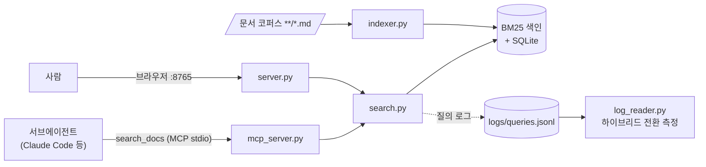

# sub-agents-RAG

> **서브에이전트에게 팀 문서를 검색시키는 로컬 MCP 서버** — BM25 · API 키 0개 · 문서 반출 0

   

Claude Code 서브에이전트(또는 CLAUDE.md/AGENTS.md 를 읽는 어떤 코딩 에이전트든)가
마크다운 문서 코퍼스를 **전문 통독 대신 조각(청크) + `파일:줄범위`** 로 검색하게 한다.
색인·검색 전부 로컬 계산이라 **키 발급도, 문서 외부 전송도 없다.**

> **TL;DR (EN)** — A fully local, zero-API-key BM25 search MCP server for markdown corpora,
> built for coding-agent subagents. Korean+English tokenization (2-gram), chunk-level results
> with file:line ranges, confidence signals, staleness warnings, and a measured path to
> hybrid (vector) search. No document ever leaves your machine.

**왜 쓰나**

- **컨텍스트 절감** — 원 프로젝트(문서 211개·421만 자) 스팟 실측(n=1): 질의 1건의 top-3 반환 ≈ 8.5천 자
  vs 해당 문서 전문 2.8만~10.9만 자, **약 3~13배**. 핵심은 `파일:줄범위`다 — 빗나가도 그 지점부터
  부분 Read 로 확대하면 되므로 전문 통독으로 돌아가지 않는다.
- **키 0 · 반출 0** — 팀원은 clone + venv 만 하면 끝. 법무·계약 문서가 섞인 코퍼스에도 안전하다.
- **한국어+영문 혼합·식별자에 강함** — `D-52`, `API-084` 같은 ID, 표·코드블록이 많은 개발 문서에서
  임베딩보다 정확하다(근거·실측: [DECISIONS.md](DECISIONS.md)).



---

## 1. 설치 (3분)

요구사항: **Python 3.12+** 뿐이다. 받자마자 동봉 예제 코퍼스로 바로 확인할 수 있다.

**Windows (PowerShell)** — venv activate 없이 `python.exe` 직접 호출을 권장:

```powershell
git clone https://github.com/myDdoDdomi/sub-agents-RAG.git
cd sub-agents-RAG
py -3.12 -m venv .venv
.\.venv\Scripts\python.exe -m pip install -r requirements.txt

# 동봉 예제 코퍼스로 즉시 스모크
$env:DOCS_RAG_ROOT = "$PWD\examples"
.\.venv\Scripts\python.exe indexer.py --stats          # 색인 생성 + 왕복 검증 (1초 미만)
.\.venv\Scripts\python.exe search.py "요청 한도 정책" --no-log
```

**macOS / Linux**:

```bash
git clone https://github.com/myDdoDdomi/sub-agents-RAG.git
cd sub-agents-RAG
python3 -m venv .venv
./.venv/bin/python -m pip install -r requirements.txt

export DOCS_RAG_ROOT="$PWD/examples"
./.venv/bin/python indexer.py --stats
./.venv/bin/python search.py "요청 한도 정책" --no-log
```

검색 결과에 `docs/api-spec_v1.md … 줄 1~26` 처럼 **파일·줄범위가 찍히면 성공**이다.
전체 검증을 돌리고 싶으면:

```powershell
.\.venv\Scripts\python.exe eval.py                       # 골든 질의 게이트 (예제용 5/5)
.\.venv\Scripts\python.exe -m unittest discover -s tests -t .   # 회귀 141건
```

## 2. 내 문서 연결

1. **문서 루트 지정** — `DOCS_RAG_ROOT` 환경변수를 문서가 있는 최상위 폴더로 지정한다
   (미지정 시 이 레포의 부모 폴더).
2. **하위 폴더 지정** — `config.py` 의 `SOURCE_DIRS`(기본 `["docs"]`)를 실제 폴더명으로 바꾼다.
   `DOCS_RAG_ROOT/<SOURCE_DIRS>/**/*.md` 가 색인 대상이다.
3. **색인** — `python indexer.py --stats`. 수백 문서·수백만 자도 수 초면 끝난다.
4. **확인** — `python search.py "<내 문서에 있는 말>" --no-log` 로 잡히는지 본다.

## 3. Claude Code 에 MCP 연결

① 프로젝트 루트(Claude Code 를 여는 폴더)에 `.mcp.json` 을 만든다 —
[`.mcp.json.example`](.mcp.json.example) 복사 후 **절대경로 3곳**만 자기 머신에 맞게 수정:

```jsonc
// Windows
{
  "mcpServers": {
    "docs-rag": {
      "command": "C:\\path\\to\\sub-agents-RAG\\.venv\\Scripts\\python.exe",
      "args": ["C:\\path\\to\\sub-agents-RAG\\mcp_server.py"],
      "env": { "DOCS_RAG_ROOT": "C:\\path\\to\\your-docs-root" }
    }
  }
}
```

```jsonc
// macOS / Linux
{
  "mcpServers": {
    "docs-rag": {
      "command": "/path/to/sub-agents-RAG/.venv/bin/python",
      "args": ["/path/to/sub-agents-RAG/mcp_server.py"],
      "env": { "DOCS_RAG_ROOT": "/path/to/your-docs-root" }
    }
  }
}
```

② Claude Code 를 재시작(또는 `/mcp` 에서 재연결)하면 프로젝트 MCP 서버 승인 여부를
물어본다 — 승인하면 끝. `/mcp` 에서 `docs-rag` 가 connected 로 보이는지 확인한다.

노출되는 툴은 2개다:

| 툴 | 하는 일 |
|---|---|
| `search_docs(query, category="all", k=5, caller_id=None)` | 조각 단위 검색 — 결과에 파일·줄범위·status·confidence 신호 포함 |
| `list_doc_categories()` | `category` 필터에 쓸 수 있는 값과 설명 |

에이전트 도구 이름으로는 `mcp__docs-rag__search_docs` · `mcp__docs-rag__list_doc_categories` 가 된다.
(`.mcp.json` 은 머신 로컬 절대경로를 담으므로 **커밋하지 않는다** — 이 레포의 `.gitignore` 에 이미 제외돼 있다.)

> 참고: `claude mcp add` CLI 로도 등록할 수 있다(`claude mcp add --help` 참조).
> 팀에 배포할 때는 `.mcp.json.example` + 경로 치환 안내가 재현성이 좋다.

## 4. 에이전트와 연결

MCP 를 연결해도 에이전트가 **언제 이 툴을 쓸지**는 알려줘야 한다. 발동 트리거를 넣는
위치는 셋 중 하나(또는 조합)다.

### 4-1. 서브에이전트에 붙이기 (`.claude/agents/*.md`)

frontmatter 의 `tools` 에 툴을 추가하고, 본문에 트리거·사용법을 넣는다:

```markdown
---
name: spec-checker
description: 명세·결정·문서 근거 확인 담당. 스펙 질문이 오면 호출.
tools: Read, Grep, Glob, mcp__docs-rag__search_docs, mcp__docs-rag__list_doc_categories
---

문서 근거가 필요하면 Grep/Read 전에 `search_docs` 를 먼저 호출한다.
- 결과의 `파일:줄범위` 로 부족하면 그 부분만 Read 로 확대한다(전문 통독 금지).
- `confidence=low/none` 이면 용어를 바꿔 1회 재질의하고, 그래도 없으면 "문서에 없음"으로 보고한다.
- `caller_id` 에 자기 이름(예: "spec-checker")을 넘긴다 — 재질의율 측정에 쓰인다.
```

### 4-2. CLAUDE.md 에 전역 규칙으로 넣기

프로젝트의 `CLAUDE.md` 에 넣으면 메인 세션·전체 작업에 적용된다:

```markdown
## 문서 검색 (docs-rag MCP)
- 스펙·결정·문서 근거가 필요하면 Grep/Read 전에 `search_docs` 를 먼저 쓴다.
- 반환된 `파일:줄범위` 밖이 필요하면 그 부분만 Read 로 확대한다 — 문서 전문 통독 금지.
- `confidence=low/none` 결과는 근거로 단정하지 않는다(재질의 또는 원문 확인).
- `[경고] 색인이 낡았다` 가 보이면 재색인(`python indexer.py`)을 제안한다.
```

### 4-3. AGENTS.md (Codex 등 다른 코딩 에이전트)

위 4-2 블록을 `AGENTS.md` 에 그대로 넣으면 AGENTS.md 규약을 읽는 에이전트에도 같은
규칙이 적용된다. 단 **MCP 서버 등록 방법은 도구마다 다르다** — stdio MCP 를 지원하는
도구라면 command/args/env 는 위 `.mcp.json` 값과 동일하게 주면 된다(서버는 표준 MCP
stdio 프로토콜만 쓴다).

### 결과 읽는 법 (에이전트가 보는 신호)

```
[신호] confidence=ok (raw_max=7.88, coverage=1.00 [5/5 토큰 매칭])
[1] docs/api-spec_v1.md (API 명세 v1 > API-002 — 요청 한도) 줄 17~26 · 점수 1.000 · raw 6.40 · status=current
```

- **confidence** — `ok`(2축 충족) / `low` / `none`. 낮으면 결과 문두에 경고가 붙고, 에이전트는
  재질의하거나 원문을 확인해야 한다. **침묵 상태가 없다** — ok 도 명시적으로 찍힌다.
- **status** — `stale`/`deprecated` 문서는 점수가 강등되고(0.35/0.15) 경고가 붙는다.
- **색인 낡음** — 원본이 색인보다 새로우면 `[경고] 색인이 낡았다(N개 문서 변경됨)` 가 자동으로 붙는다.

## 5. 자기 코퍼스 튜닝 (4단계)

1. **`config.py` `CATEGORY_RULES`** — 경로 조각 → 카테고리 매핑을 자기 폴더·파일 명명에 맞춘다.
   어느 규칙에도 안 걸린 문서는 `etc` 로 떨어져 카테고리 필터로 못 찾는다
   (색인 후 `list_doc_categories` + 검색 결과의 `category` 로 확인).
2. **`glossary.tsv`** — 자기 도메인의 한↔영 동의어로 교체한다(형식·등재 기준은 파일 머리말.
   grep 으로 양쪽 표기가 실제 존재하는지 확인 후 등재 — 억지 등재는 평가를 자기순환으로 만든다).
3. **`eval.py` `GOLDEN`** — 자기 코퍼스의 실제 질의·기대 문서로 교체한다(동봉분은 예제용.
   결과를 보기 전에 기대값을 먼저 고정한다 — 파일 머리말의 무결성 조건).
4. **문서 머리말 컨벤션** — 구버전 문서 머리말에 `status: stale` 한 줄(또는 "최신 정본은 \`...\`")을
   넣으면 검색에서 자동 강등된다. 폐기는 `status: deprecated`.

## 6. 운영

- **재색인** — 문서를 고치면 `python indexer.py --stats`. 전체 재색인 + 왕복 검증이며 실패 시
  기존 색인이 보존된다. 검증 절차 전체는 [rag-reindex 스킬](.claude/skills/rag-reindex/SKILL.md)
  — 이 레포를 Claude Code 로 열면 `/rag-reindex` 로도 돌릴 수 있다.
  MCP 서버는 **색인 세대를 자동 감지해 재로드**하므로 재색인 후 재시작이 필요 없다.
- **질의 로그** — 실사용 질의는 `logs/queries.jsonl` 에 쌓인다(검증·합성 질의는 `--no-log` 로
  제외). `python log_reader.py` 가 재질의율·용어 불일치율을 집계한다.
- **하이브리드(벡터) 전환은 측정으로** — 로그 집계가 [DECISIONS.md](DECISIONS.md) 의 전환 조건
  (재질의 30%·용어 불일치 20% 초과)을 넘을 때만 연다. 인터페이스·점수 정규화·청크·로그 4개
  이음매가 미리 심겨 있어 전환 시 `search.py` 내부만 바뀐다(에이전트 무수정).
  임베딩은 반환 토큰량을 줄여주지 않는다는 점도 같은 문서에 정리돼 있다.
- **사람용 UI** — `python server.py` → http://127.0.0.1:8765 (루프백 전용, Host 헤더 검증).

## 7. 왜 BM25 인가 (임베딩이 아니라)

개발 문서 코퍼스의 주 신호는 렉시컬이다 — 엔드포인트·필드명·ID 는 이미 문자 그대로 검색되고,
임베딩은 `D-52` 와 `D-53` 을 구분하지 못하며 표·코드를 뭉갠다. 연구도 같은 방향이다
(BM25 가 `text-embedding-3-large` 를 Recall@20 외 전 지표에서 이긴 실측, BM25+에이전틱 루프가
임베딩 단독을 능가한다는 BRIGHT 계열 결과). 상세 근거·기각안·전환 조건: **[DECISIONS.md](DECISIONS.md)**.

## 8. 구조

```
mcp_server.py   MCP stdio 서버 (서브에이전트용, stdout 오염 방어 내장)
server.py       로컬 HTTP UI + JSON API (127.0.0.1 전용)
search.py       검색 코어 — confidence 2축 · staleness · 질의 로그 · CLI
indexer.py      색인 생성 (bm25s + SQLite, 왕복 검증, 3단 rename 원자 교체)
chunker.py      헤딩 경계 청킹 + status(stale/폐기) 판정
tokenizer.py    한글 2-gram + 영문/숫자 토큰화 + 용어집 질의 확장
config.py       공개 설정 표면 (문서 루트·카테고리·청킹·가중치)
glossary.tsv    질의 확장 동의어 (탭 구분)
eval.py         골든 질의 검증 게이트 + confidence 하한 측정(--floor)
log_reader.py   질의 로그 판독 — 하이브리드 전환 조건 측정
tests/          회귀 141건 (합성 코퍼스 기반 — 색인 없이도 통과, 색인 있으면 통합 티어까지)
examples/docs/  예제 코퍼스 3문서 (골든·용어집 데모와 연동)
```

## 9. 트러블슈팅

| 증상 | 원인 · 해법 |
|---|---|
| `ImportError: ... 'MCPServer'` | `mcp` 1.x 가 설치됨 — `pip show mcp` 로 확인, **2.0 이상** 필요(`pip install -r requirements.txt` 재실행) |
| 검색 결과가 `[안내] 색인이 없다` | `python indexer.py` 를 먼저 실행(그 프로세스의 `DOCS_RAG_ROOT` 가 서버와 같은지 확인) |
| 재색인 시 `PermissionError [WinError 5]` | MCP 서버 등 다른 프로세스가 `chunks.sqlite` 를 열고 있음 — 종료 후 재실행 |
| PowerShell 에서 venv activate 실패 | activate 불필요 — `.\.venv\Scripts\python.exe` 를 직접 호출하는 방식을 권장 |
| 콘솔 한글 깨짐 (cp949) | `PYTHONUTF8=1` 설정(코드에도 방어가 있으나 콘솔 자체 출력용) |
| confidence 가 계속 `low` | 코퍼스가 작으면 BM25 절대 점수가 낮게 나온다 — 임계는 원 코퍼스 실측 보정치이므로 `python eval.py --floor` 로 자기 코퍼스 분포를 재고 `search.py` 의 `RAW_MAX_FLOOR` 를 조정 |
| Claude Code 에서 서버가 안 보임 | `.mcp.json` 위치(Claude Code 를 *여는* 폴더)와 절대경로 오타 확인 → 재시작 → `/mcp` |

## 라이선스

[MIT](LICENSE)
